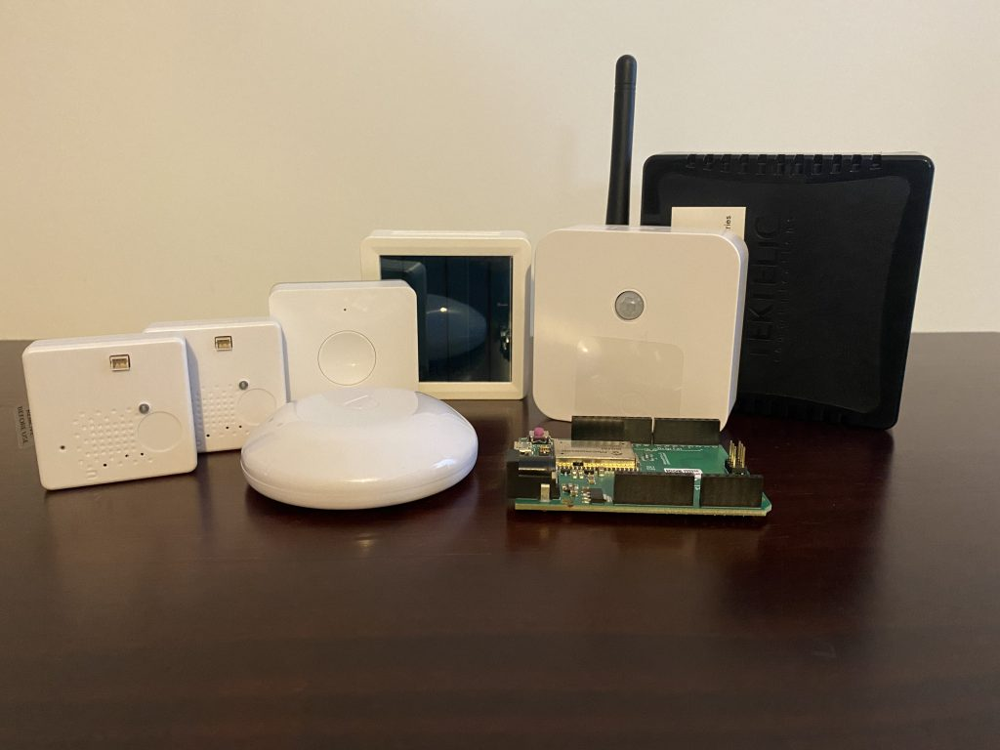

# LoRaWAN Decoders
## Collection of LoRaWAN payload decoders
Collection of LoRaWAN payload decoders for all sensors in [The Things Conference](https://www.thethingsnetwork.org/conference/) kit.

> _Also added the Elsys ERS ECO model which I got for free at the conference_

All the files in this repo are found freely on the internet except for the MerryIoT Motion Sensor. I wrote that one myself because I could not find an example online. 

__This is just a ( personal ) collection of payload decoders__

These are being used on [TTN](https://www.thethingsnetwork.org/) ( The Things Network )

_( Written in javascript language )_

# Sensors

### COMFORT BASE SMART ROOM SENSOR
(https://www.tektelic.com/products/sensors/comfort-base-smart-room-sensor/)

### MerryIoT Motion Detection
(https://www.merryiot.com/Product/Detail/2)

### Milesight Button
(https://www.milesight-iot.com/lorawan/button/ws101/)

### MClimate Flood Sensor
(https://mclimate.eu/products/flood-sensor-lorawan)

### Elsys ERS-ECO
(https://www.elsys.se/shop/product/ers-eco/?v=f003c44deab6)

   

## Blog
Want to know how the conference was? Read my blog [here](https://technology.amis.nl/iot/things-conference-2022-implementing-iot-at-scale/):

https://technology.amis.nl/iot/things-conference-2022-implementing-iot-at-scale/